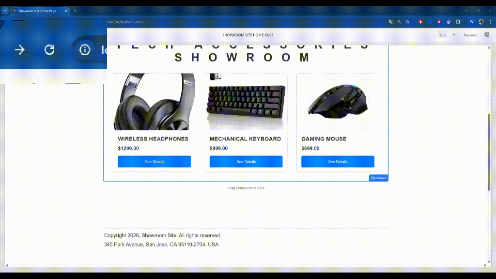

# AEM React Showroom

Prueba técnica – US-001: Configuración del proyecto base con integración de AEM y React.

### Prerrequisitos
- Java (según tu instalación de AEM 6.5)
- Maven 3.8+
- Node.js + npm (para `ui.frontend`)

### 1 Crear el proyecto (AEM Archetype v54)
```bash
mvn -B org.apache.maven.plugins:maven-archetype-plugin:3.3.1:generate ^
  -DarchetypeGroupId=com.adobe.aem ^
  -DarchetypeArtifactId=aem-project-archetype ^
  -DarchetypeVersion=54 ^
  -DappTitle="Showroom Site" ^
  -DappId=showroom ^
  -DgroupId=com.showroom ^
  -DfrontendModule=react ^
  -DincludeExamples=n ^
  -DaemVersion=6.5.8
```

### 2 Build + deploy (paquete único)

Requiere una instancia local de AEM en ejecución (Author).
```
mvn clean install -PautoInstallSinglePackageage
```

### 3) Nota (solo si falla el build del frontend por OpenSSL)

Si al correr el frontend aparece un error relacionado con OpenSSL/webpack en Node, se puede usar:
--openssl-legacy-provider

En ui.frontend/package.json:

"start": "react-scripts --openssl-legacy-provider start"

### Demo page
URL: /content/showroom/us/en/showroom-demo.html
Resultado esperado: un componente React básico renderizado dentro de una página AEM.

## US-002 – Modelo de Contenido en AEM (Backend ligero)

El componente *Showroom* define un modelo de contenido simple mediante un multifield, donde cada item representa un producto del showroom.

Cada producto contiene las siguientes propiedades:
- title
- description
- fileReference (imagen en DAM)
- price
- sku

### Exposición de datos en JSON

El componente expone su información mediante el Sling Model Exporter utilizando la extensión
`.model.json`.

Ejemplo de URL para obtener el JSON del componente:

/content/showroom/us/en/home/jcr:content/root/responsivegrid/showroom.model.json

### US-003 -  Desarrollo de Componentes React

Se implementa un showroom de productos utilizando React, enfocado en la creación de componentes funcionales, manejo básico de estado e interacción, como parte de la prueba técnica AEM / React.

## Estructura de Componentes

- **Showroom**
  - Contenedor principal del showroom
  - Maneja el estado de selección del producto
  - Renderiza el grid de productos y el modal de detalle

- **ShowroomCard**
  - Representa un producto individual dentro del listado
  - Muestra imagen, título y precio
  - Dispara el evento para ver el detalle

- **ProductModal**
  - Muestra el detalle del producto seleccionado
  - Permite cerrar por botón, click en overlay o tecla Escape
  - Implementa atributos básicos de accesibilidad

## Manejo de Estado

Se utiliza `useState` para manejar el producto seleccionado:

- `null` → modal cerrado
- `Product Object` → modal abierto con detalle

Este enfoque mantiene el estado simple y fácil de escalar en futuras integraciones.

## US-004 – Integración React + AEM

### Integración del componente en AEM (SPA Editor)
Para integrar el componente React dentro de AEM se utilizó `@adobe/aem-react-editable-components`.

- El componente `Showroom` se mapea a un `resourceType` de AEM mediante `MapTo`.
- AEM provee el contenido dinámicamente hacia React a través de `props` (por ejemplo `showroomTitle` e `items`).
- Se incluyó `EditConfig` para soportar el comportamiento en Author (empty state) mediante:
  - `emptyLabel`: etiqueta visible en el editor
  - `isEmpty`: condición para marcar el componente como vacío

**ResourceType mapeado:**
- `showroom/components/showroom`

### Consumo dinámico de datos
Los datos del showroom se consumen de manera dinámica desde AEM mediante `props` (inyectados por el modelo JSON del SPA Editor / exporter).  
Se eliminaron mocks/hardcode del componente principal y se renderiza el listado a partir de `props.items`.

### Integración de assets (bundling/clientlibs)
El CSS del showroom (`Showroom.css`) forma parte del build del frontend React.  
El generador `aem-clientlib-generator` mueve automáticamente el codigo compilado a `ui.apps` en `/apps/showroom/clientlibs/clientlib-react`.

## Resiliencia y gestión de errores
Dado que esta entrega no incluye imágenes en el paquete:
* **Imagen de reserva:** El componente React implementa un controlador `onError` en los elementos de imagen. Si la ruta de referencia en AEM (por ejemplo, `/content/dam/showroom/products/...`) no existe o no se carga, la interfaz de usuario recurre automáticamente a un placeholder (`https://placehold.co/300x300`).

### Evidencia de actualización de UI
Al actualizar el contenido del showroom en AEM (por ejemplo, título/propiedades de un ítem) React re-renderiza automáticamente al recibir nuevas `props`.  


## US-005 – Pruebas Automatizadas

Este ticket agrega pruebas automatizadas enfocadas en la lógica principal, priorizando frontend y agregando un ejemplo de test en backend.

### Frontend (React)

**Stack**
- React Testing Library
- `@testing-library/user-event`
- Jest setup provisto por el arquetipo AEM (archivo `setupTest.js`)

**Ubicación de pruebas**
- `ui.frontend/src/utils/formatters.test.js`
- `ui.frontend/src/components/Showroom/Showroom.test.js`

#### Pruebas incluidas

1) **Helper `formatPrice`**
- Verifica formateo estándar a 2 decimales
- Acepta strings numéricos
- Maneja valores inválidos devolviendo `"N/A"` (incluye `null` y `undefined`)

> Cambio asociado: se añadió una validación explícita en `formatters.js` para `null/undefined`:

2) **Componente `Showroom`**
Tests representativos de render, interacción y estado:
Empty state: muestra "No products available" cuando no hay items.
Render con datos: renderiza título, card y precio formateado.
Interacción modal: abre el modal al hacer clic en "See Details" y muestra el detalle.
Cierre de modal: cierra con el botón de cerrar (aria-label="Close").

#### Ejecutar tests (frontend)
Desde ui.frontend:

`npm test`

### Backend (AEM / Sling Model)

Se agregó un ejemplo de prueba unitaria para el modelo ShowroomModel utilizando `AEM Mocks`:

**JSON de contexto: `ShowroomModelTest.json`**
**Test JUnit 5: `ShowroomModelTest.java`**

#### Qué valida

Adaptación correcta del request al Sling Model
Lectura de propiedades (showroomTitle)
Lectura de items y tamaño esperado
Validación de valores del primer ítem 

#### Ejecutar tests (backend)
Desde core:

`mvn test`

# Sample AEM project template

This is a project template for AEM-based applications. It is intended as a best-practice set of examples as well as a potential starting point to develop your own functionality.

## Modules

The main parts of the template are:

* [core:](core/README.md) Java bundle containing all core functionality like OSGi services, listeners or schedulers, as well as component-related Java code such as servlets or request filters.
* [it.tests:](it.tests/README.md) Java based integration tests
* [ui.apps:](ui.apps/README.md) contains the /apps (and /etc) parts of the project, ie JS&CSS clientlibs, components, and templates
* [ui.content:](ui.content/README.md) contains sample content using the components from the ui.apps
* ui.config: contains runmode specific OSGi configs for the project
* [ui.frontend:](ui.frontend.general/README.md) an optional dedicated front-end build mechanism (Angular, React or general Webpack project)
* [ui.tests:](ui.tests/README.md) Cypress based UI tests (for other frameworks check [aem-test-samples](https://github.com/adobe/aem-test-samples) repository
* all: a single content package that embeds all of the compiled modules (bundles and content packages) including any vendor dependencies
* analyse: this module runs analysis on the project which provides additional validation for deploying into AEMaaCS

## How to build

To build all the modules run in the project root directory the following command with Maven 3:

    mvn clean install

To build all the modules and deploy the `all` package to a local instance of AEM, run in the project root directory the following command:

    mvn clean install -PautoInstallSinglePackage

Or to deploy it to a publish instance, run

    mvn clean install -PautoInstallSinglePackagePublish

Or alternatively

    mvn clean install -PautoInstallSinglePackage -Daem.port=4503

Or to deploy only the bundle to the author, run

    mvn clean install -PautoInstallBundle

Or to deploy only a single content package, run in the sub-module directory (i.e `ui.apps`)

    mvn clean install -PautoInstallPackage

## Documentation

The build process also generates documentation in the form of README.md files in each module directory for easy reference. Depending on the options you select at build time, the content may be customized to your project.

## Testing

There are three levels of testing contained in the project:

### Unit tests

This show-cases classic unit testing of the code contained in the bundle. To
test, execute:

    mvn clean test

### Integration tests

This allows running integration tests that exercise the capabilities of AEM via
HTTP calls to its API. To run the integration tests, run:

    mvn clean verify -Plocal

Test classes must be saved in the `src/main/java` directory (or any of its
subdirectories), and must be contained in files matching the pattern `*IT.java`.

The configuration provides sensible defaults for a typical local installation of
AEM. If you want to point the integration tests to different AEM author and
publish instances, you can use the following system properties via Maven's `-D`
flag.

| Property              | Description                                         | Default value           |
|-----------------------|-----------------------------------------------------|-------------------------|
| `it.author.url`       | URL of the author instance                          | `http://localhost:4502` |
| `it.author.user`      | Admin user for the author instance                  | `admin`                 |
| `it.author.password`  | Password of the admin user for the author instance  | `admin`                 |
| `it.publish.url`      | URL of the publish instance                         | `http://localhost:4503` |
| `it.publish.user`     | Admin user for the publish instance                 | `admin`                 |
| `it.publish.password` | Password of the admin user for the publish instance | `admin`                 |

The integration tests in this archetype use the [AEM Testing
Clients](https://github.com/adobe/aem-testing-clients) and showcase some
recommended [best
practices](https://github.com/adobe/aem-testing-clients/wiki/Best-practices) to
be put in use when writing integration tests for AEM.

## Static Analysis

The `analyse` module performs static analysis on the project for deploying into AEMaaCS. It is automatically
run when executing

    mvn clean install

from the project root directory. Additional information about this analysis and how to further configure it
can be found here https://github.com/adobe/aemanalyser-maven-plugin

### UI tests

They will test the UI layer of your AEM application using Cypress framework.

Check README file in `ui.tests` module for more details.

Examples of UI tests in different frameworks can be found here: https://github.com/adobe/aem-test-samples

## ClientLibs

The frontend module is made available using an [AEM ClientLib](https://helpx.adobe.com/experience-manager/6-5/sites/developing/using/clientlibs.html). When executing the NPM build script, the app is built and the [`aem-clientlib-generator`](https://github.com/wcm-io-frontend/aem-clientlib-generator) package takes the resulting build output and transforms it into such a ClientLib.

A ClientLib will consist of the following files and directories:

- `css/`: CSS files which can be requested in the HTML
- `css.txt` (tells AEM the order and names of files in `css/` so they can be merged)
- `js/`: JavaScript files which can be requested in the HTML
- `js.txt` (tells AEM the order and names of files in `js/` so they can be merged
- `resources/`: Source maps, non-entrypoint code chunks (resulting from code splitting), static assets (e.g. icons), etc.

## Maven settings

The project comes with the auto-public repository configured. To setup the repository in your Maven settings, refer to:

    http://helpx.adobe.com/experience-manager/kb/SetUpTheAdobeMavenRepository.html
